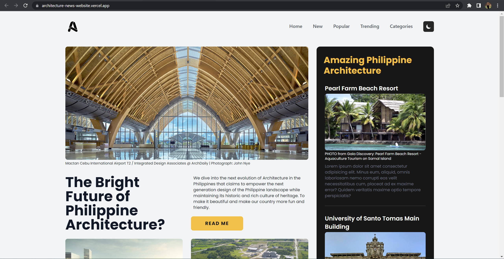
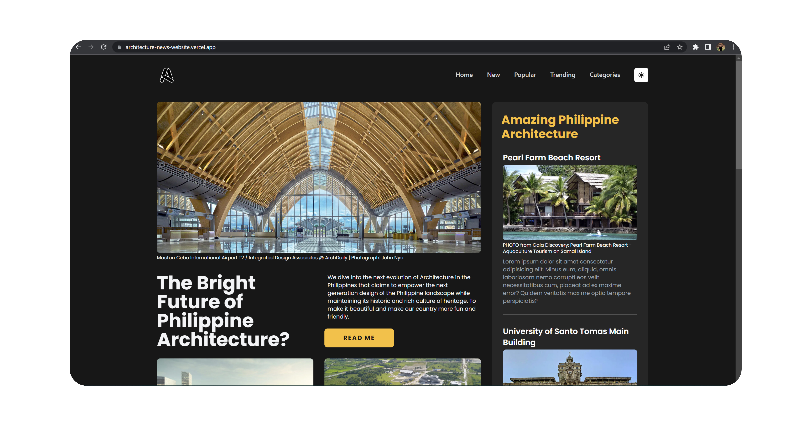

<!-- markdownlint-configure-file {
  "MD013": {
    "code_blocks": false,
    "tables": false
  },
  "MD033": false,
  "MD041": false
} -->

  

# Architecture News

This is the Architecture News Website homepage created with Next Js, Tailwind
CSS and Dark Mode Feature. Take a look at this incredible list of stunning
Philippine architecture throughout the country.

## Website

🖥️ [https://architecture-news-website.vercel.app/]

✍️ Project by John Cañero

## Responsive Design

🪟: [Desktop - Tablet - Mobile]

Desktop Responsive Light

Desktop Responsive Dark

Tablet Responsive | Light and Dark

Mobile Responsive | Light and Dark

